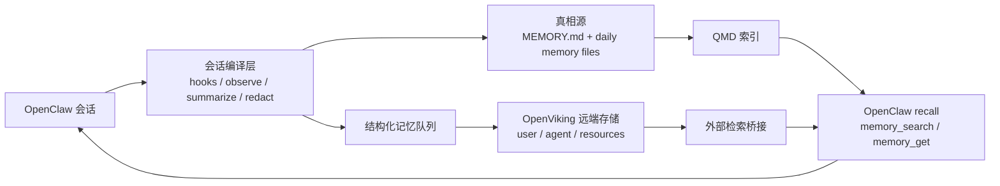

# OpenClaw 记忆系统整合方案

GitHub 文档地址：
- https://github.com/583721/openclaw-deployable-package-clean/blob/main/docs/openclaw-memory/openclaw-memory-production-runbook.md
- https://github.com/583721/openclaw-deployable-package-clean/blob/main/docs/openclaw-memory/openclaw-memory-merged-architecture.md
- https://github.com/583721/openclaw-deployable-package-clean/blob/main/docs/openclaw-memory/openclaw-memory-deploy-prompt.txt

适用场景：
- 你的线上 OpenClaw
- 参考了 `OpenViking` 和 `claude-mem`
- 希望让其他 AI 直接照着部署

---

## 一句话结论

不要把 `OpenViking` 和 `claude-mem` 当成两个并行的 OpenClaw memory 插件一起装。

更稳的做法是：
- OpenClaw 官方 `memory-core + qmd` 继续做主链路
- `MEMORY.md + memory/YYYY-MM-DD.md` 继续做真相源
- 借 `claude-mem` 的 hooks / observation / summarize 思路，做“会话编译层”
- 借 `OpenViking` 的层级目录和远端存储能力，做“长期知识检索层”

也就是说：
- `claude-mem` 只借设计，不直接作为线上主插件
- `OpenViking` 只做结构化长期记忆库，不接管 `MEMORY.md`

---

## 当前两套方案的直接冲突

### 1. memory 插槽冲突

OpenClaw 的 `plugins.slots.memory` 是排他的，同一时刻只能选一个 memory 插件。

因此不能同时把：
- `memory-core`
- `OpenViking memory plugin`
- `claude-mem`

都挂成“主记忆插件”。

### 2. `MEMORY.md` 归属冲突

OpenClaw 官方把 `MEMORY.md` 定位成“人工可审计的长期记忆文件”。

但 `claude-mem` 的 OpenClaw 集成会在：
- `before_agent_start`
- `tool_result_persist`

期间同步写入 `MEMORY.md`，而且 `syncMemoryFile` 默认就是 `true`。

这会把“策展后的长期记忆”变成“自动拼接出来的上下文镜像”，线上很容易失控。

### 3. 工具接口不一致

OpenClaw 官方主线工具是：
- `memory_search`
- `memory_get`

OpenViking example 插件注册的是：
- `memory_recall`
- `memory_store`
- `memory_forget`

两边抽象不同，直接混用会让提示词、调用习惯、上下文注入策略都变复杂。

### 4. 自动写入会双写和回流

OpenViking example 倾向：
- `autoRecall = true`
- `autoCapture = true`

`claude-mem` 也会：
- 抓 session
- 抓 tool observations
- 总结后继续同步

两套一起开，很容易出现：
- 重复存储
- 召回结果再次被学习
- 错误记忆被不断强化

### 5. 生产治理要求不同

`OpenViking` 适合做结构化上下文数据库。

`claude-mem` 更像会话观察和压缩系统，而且它的许可与部署复杂度也更高，线上直接改造成本更大。

---

## 推荐的最终架构



### 第 1 层：真相源

只保留两个官方文件入口：
- `MEMORY.md`
- `memory/YYYY-MM-DD.md`

职责：
- `MEMORY.md`：长期规则、长期偏好、确认过的事实、运维铁律
- `memory/YYYY-MM-DD.md`：当日过程、排障记录、临时上下文、待晋升内容

规则：
- 任何长期记忆都必须先能落到 Markdown
- 任何错误记忆都必须能人工删除和回滚

### 第 2 层：会话编译层

这层借 `claude-mem` 的思想，但不直接照搬它的插件。

职责：
- 监听会话生命周期和工具结果
- 提取 observation
- 做脱敏、去重、降噪
- 只把“值得记”的内容升级成结构化记忆

推荐监听点：
- `before_agent_start`
- `tool_result_persist`
- `agent_end`
- `after_compaction`

这层输出两路数据：
- 一路写回 Markdown
- 一路写入结构化记忆队列，异步同步给 OpenViking

### 第 3 层：检索层

检索拆成两部分：

- OpenClaw 官方 `memory-core + qmd`
  - 检索 `MEMORY.md`
  - 检索 `memory/**/*.md`
  - 可选检索 session transcript

- OpenViking
  - 保存结构化长期知识
  - 保存分层资源目录
  - 保存按 scope 隔离的 agent 经验

重点：
- OpenClaw 的主对话注入链路仍然保持单一
- 不要让两套系统同时往主 prompt 里塞上下文

---

## OpenViking 应该负责什么

只让 OpenViking 做这几类事：

- 长期用户偏好
- 长期项目事实
- 运维 runbook
- 历史 incident
- 项目资源目录
- 结构化文档导航

推荐 URI 规划：

- `viking://user/memories/preferences`
- `viking://user/memories/facts`
- `viking://agent/memories/incidents`
- `viking://agent/memories/runbooks`
- `viking://resources/<project>/docs`
- `viking://resources/<project>/configs`

为什么适合它：
- 它的层级目录和 L0/L1/L2 加载模型很适合做“目录化上下文”
- 远端模式更适合线上，不需要把 Python/本地服务都塞进 Gateway

---

## claude-mem 应该借什么，不该借什么

### 借它的

- hooks 驱动
- observation 模型
- 会话总结
- progressive disclosure 的思路
- 对工具结果做增量压缩

### 不借它的

- 不直接让它接管 OpenClaw 的 memory 插槽
- 不直接让它覆盖 `MEMORY.md`
- 不直接让它把所有 observation 自动同步成长记忆
- 不直接把它的 worker 体系塞进生产主路径

---

## 记忆数据模型

建议统一成一个结构化条目，再决定落 Markdown、OpenViking，还是两边都写。

```json
{
  "id": "mem_20260313_xxx",
  "scope": {
    "tenantId": "default",
    "projectId": "openclaw-prod",
    "agentId": "main",
    "userId": "owner"
  },
  "type": "operational_rule",
  "title": "Gateway 更新后先做本地健康检查",
  "summary": "每次替换 control-ui 或 memory 配置后，先检查 127.0.0.1 再查公网访问。",
  "body": "详细规则或原始笔记",
  "tags": ["gateway", "deploy", "healthcheck"],
  "source": {
    "kind": "session",
    "sessionId": "main-20260313",
    "messageRef": "tool_result_persist"
  },
  "confidence": 0.92,
  "verified": true,
  "sensitivity": "internal",
  "createdAt": "2026-03-13T10:00:00+08:00",
  "lastVerifiedAt": "2026-03-13T10:20:00+08:00"
}
```

### `type` 推荐枚举

- `fact`
- `preference`
- `operational_rule`
- `incident`
- `runbook`
- `resource`
- `session_note`

### `sensitivity` 推荐枚举

- `public`
- `internal`
- `secret`

规则：
- `secret` 一律不进长期记忆库
- 最多只允许脱敏摘要进入 `session_note`

---

## 写入纪律

### 允许直接写入 `MEMORY.md` 的内容

- 明确的用户长期偏好
- 已验证的项目事实
- 稳定运维规则
- 反复出现且已确认的故障经验

### 只写到 `memory/YYYY-MM-DD.md` 的内容

- 临时排障过程
- 中间猜测
- 一次性上下文
- 尚未验证的方案

### 禁止写入长期记忆的内容

- 密码
- token
- cookie
- 私钥
- 邮箱验证码
- 含敏感客户数据的原文

---

## 召回纪律

召回不要贪多，线上一定限流。

建议默认：
- `maxResults = 6`
- `maxInjectedChars = 1800-2400`
- 优先短摘要，不直接注入长文
- 同类记忆去重
- 当次对话里已经出现过的记忆，不重复注入

召回顺序建议：
1. `MEMORY.md`
2. 最近 7 天 `memory/*.md`
3. OpenViking 的 `runbooks` / `incidents`
4. OpenViking 的 `resources`

---

## 最适合你线上 OpenClaw 的落地版本

### V1：生产稳态版

只做这些：
- `plugins.slots.memory = "memory-core"`
- `memory.backend = "qmd"`
- 开启 `memoryFlush`
- 保留 `MEMORY.md + memory/YYYY-MM-DD.md`
- 用 OpenViking 远端服务保存结构化知识
- 先人工或半自动把关长期记忆写入

这个版本最稳，适合先上线。

### V2：增强版

在 V1 稳定后再加：
- 会话编译层
- 自动 observation 提取
- incident 自动归档
- runbook 自动候选生成
- OpenViking 异步同步

### V3：谨慎尝试版

最后才考虑：
- 更强自动学习
- 规则自动晋升
- 更复杂的跨项目共享记忆

这一步一定要先在测试环境跑。

---

## 其他 AI 直接执行的实施清单

### A. 保留官方主链路

确认：
- `plugins.slots.memory = "memory-core"`
- `memory.backend = "qmd"`

不要切：
- `memory-lancedb`
- `claude-mem` 作为主 memory 插件
- `OpenViking example plugin` 直接替换 memory-core

### B. 初始化记忆文件

创建：
- `MEMORY.md`
- `memory/`

建议模板：

```md
# Long-Term Memory

## Project Facts

## Operational Rules

## Infra / Deployment Notes

## Known Incidents

## User Preferences
```

### C. 安装 QMD 并启用混合检索

目标：
- 官方记忆主线不变
- 让 Markdown 记忆和可选 session transcript 都能检索

### D. 部署 OpenViking 远端服务

要求：
- 单独服务化
- 不和 Gateway 进程耦合
- 使用远端模式
- 开启鉴权
- 按 `tenant / project / agent / user` 做 scope

### E. 新增“会话编译器”

实现一个轻量 sidecar 或 worker：
- 监听 OpenClaw 生命周期事件
- 把 observation 压成结构化记忆候选
- 先脱敏
- 再落 `memory/YYYY-MM-DD.md`
- 通过规则晋升到 `MEMORY.md`
- 异步同步到 OpenViking

### F. 加记忆治理

必须有：
- 审计日志
- 可删除
- 可回滚
- 可冻结某条记忆
- 可按 scope 清理

### G. 验收

至少做这 6 个测试：

1. 写入一条用户偏好，能进入 `MEMORY.md`
2. 写入一条临时排障记录，只进入当日日志
3. 召回时能先命中 `MEMORY.md`
4. OpenViking 的 `runbook` 能被正确检索
5. 密码或 token 不会进入长期记忆
6. 删除一条错误记忆后，下一轮召回不再返回

---

## 发给其他 AI 的极简执行提示词

```text
请按以下架构为线上 OpenClaw 部署记忆系统：

1. 保持 OpenClaw 官方主链路：
   - plugins.slots.memory = "memory-core"
   - memory.backend = "qmd"
   - 启用 MEMORY.md 和 memory/YYYY-MM-DD.md

2. 不要把 OpenViking 和 claude-mem 直接同时作为 OpenClaw memory 插件安装。

3. 部署一个三层记忆架构：
   - 真相源：MEMORY.md + memory/YYYY-MM-DD.md
   - 会话编译层：从 hooks 提取 observation，做脱敏、去重、总结
   - 长期检索层：OpenViking remote mode，保存 preferences / facts / incidents / runbooks / resources

4. claude-mem 只借设计思路，不直接接管 MEMORY.md。

5. OpenViking 只做结构化长期记忆和资源库，不替换官方 memory-core。

6. 任何长期记忆必须：
   - 可审计
   - 可删除
   - 可回滚
   - 不含密码、token、cookie、私钥

7. 先做 V1：
   - 官方 memory-core + qmd
   - OpenViking remote service
   - 半自动记忆写入

8. 再做 V2：
   - observation compiler
   - incident / runbook 自动候选
   - 异步同步到 OpenViking

请先备份当前配置，再落地，并输出最终报告：
- 实际修改了哪些配置
- OpenViking 部署位置
- QMD 是否生效
- 记忆写入/召回验收结果
- 回滚方式
```

---

## 最后的建议

如果你只想先把线上版本做稳，不要追求“一步到位自主学习”。

最推荐的顺序是：
1. 先把官方 `memory-core + qmd` 跑稳
2. 再把 OpenViking 作为长期知识库接进来
3. 最后才加借鉴自 `claude-mem` 的自动观察和自动晋升

这样收益最大，风险最小，也最容易让其他 AI 接手部署。
